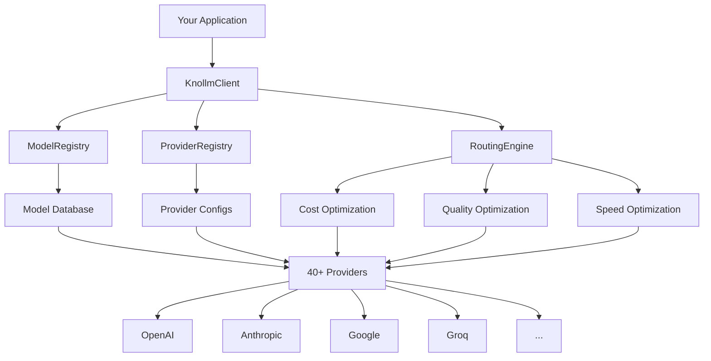

# Getting Started with Claif Knollm

Welcome to **Claif Knollm** - the most comprehensive LLM provider catalog and intelligent routing system. This guide will get you up and running in minutes.

## What is Claif Knollm?

Claif Knollm is a Python library and CLI tool that provides:

- **📊 Complete LLM catalog** - Data on 40+ providers and 10,000+ models
- **🧠 Intelligent routing** - Automatically select optimal providers
- **💰 Cost optimization** - Find the cheapest models for your needs
- **🔄 Auto-failover** - Built-in redundancy and reliability
- **🐍 Python-first** - Native integration with type hints and async support

## Your Path to Success

Follow these steps to master Claif Knollm:

<div class="grid cards" markdown>

-   :material-download:{ .lg .middle } **[Installation →](installation.md)**

    ---

    Install Claif Knollm and set up your development environment with all the necessary dependencies.

-   :material-rocket-launch:{ .lg .middle } **[Quick Start →](quickstart.md)**

    ---

    Build your first multi-provider LLM application in under 5 minutes with practical examples.

-   :material-cog:{ .lg .middle } **[Configuration →](configuration.md)**

    ---

    Configure providers, set up API keys, and customize Knollm for your specific needs.

</div>

## Architecture Overview

Knollm is designed around three core components:



### Core Components

**🔍 ModelRegistry**
: Comprehensive database of 10,000+ models with capabilities, pricing, and performance metrics.

**🏭 ProviderRegistry**  
: Configuration and status management for 40+ LLM providers.

**🧭 KnollmClient**
: Main interface for making requests with intelligent routing and failover.

**⚡ RoutingEngine**
: Algorithms for selecting optimal providers based on cost, quality, speed, and availability.

## Key Features

### Universal Provider Support

Connect to any LLM provider through a unified interface:

```python
from claif_knollm import KnollmClient

# Works with any provider automatically
client = KnollmClient()
response = await client.create_completion(
    messages=[{"role": "user", "content": "Hello!"}]
)
```

### Intelligent Model Selection

Let Knollm choose the best model for your needs:

```python
from claif_knollm import ModelRegistry, ModelCapability

registry = ModelRegistry()

# Find optimal models automatically
model = registry.find_optimal_model(
    required_capabilities=[ModelCapability.VISION],
    max_cost_per_1k_tokens=0.01,
    min_quality_score=0.8
)
```

### Cost Optimization

Minimize your LLM expenses automatically:

```python
from claif_knollm import KnollmClient, RoutingStrategy

# Always choose the cheapest suitable option
client = KnollmClient(routing_strategy=RoutingStrategy.COST_OPTIMIZED)
```

## Common Use Cases

=== "Chatbots & Assistants"

    Build cost-effective chatbots that automatically scale across providers:
    
    ```python
    client = KnollmClient(
        routing_strategy=RoutingStrategy.COST_OPTIMIZED,
        fallback_providers=["groq", "deepseek", "openai"]
    )
    ```

=== "Content Generation"

    Generate high-quality content with optimal provider selection:
    
    ```python
    client = KnollmClient(
        routing_strategy=RoutingStrategy.QUALITY_OPTIMIZED,
        required_capabilities=[ModelCapability.TEXT_GENERATION]
    )
    ```

=== "Code Analysis"

    Analyze code with models specialized for programming:
    
    ```python
    registry = ModelRegistry()
    code_models = registry.search_models(
        required_capabilities=[ModelCapability.CODE_GENERATION],
        sort_by="quality_score"
    )
    ```

=== "Vision Tasks"

    Process images with the best vision models:
    
    ```python
    vision_model = registry.find_optimal_model(
        required_capabilities=[ModelCapability.VISION],
        quality_threshold=0.9
    )
    ```

## What's Next?

Ready to dive deeper? Here are your next steps:

1. **[Install Knollm →](installation.md)** - Get everything set up
2. **[Quick Start Tutorial →](quickstart.md)** - Build your first app
3. **[Explore Providers →](../providers/)** - Learn about the ecosystem
4. **[Browse Models →](../models/)** - Discover the perfect model
5. **[Python Libraries →](../libraries/)** - Choose the right tools

---

<div class="admonition tip">
<p class="admonition-title">💡 Pro Tip</p>
<p>Start with the <a href="quickstart/">Quick Start guide</a> to see Knollm in action with real examples you can run immediately!</p>
</div>