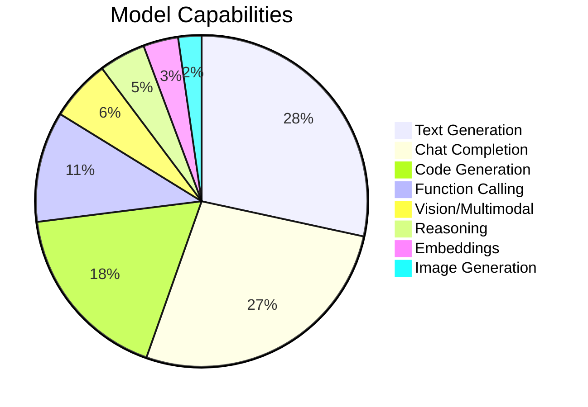

# Model Database

Explore the world's most comprehensive database of **10,000+ LLM models** from 40+ providers. Find the perfect model for your specific needs with advanced search and filtering capabilities.

## Database Overview

<div class="grid cards" markdown>

-   :material-database-search:{ .lg .middle } **Advanced Search**

    ---

    Search through 10,000+ models by capability, cost, performance, and more with powerful filters.

    [:octicons-arrow-right-24: Search Models](search.md)

-   :material-brain:{ .lg .middle } **Model Capabilities**

    ---

    Understand model capabilities from text generation to vision, coding, and reasoning.

    [:octicons-arrow-right-24: Explore Capabilities](capabilities.md)

-   :material-cash:{ .lg .middle } **Pricing Database**

    ---

    Real-time pricing data and cost optimization tools to minimize your LLM expenses.

    [:octicons-arrow-right-24: Pricing Guide](pricing.md)

-   :material-table:{ .lg .middle } **Full Database**

    ---

    Browse the complete model database with sortable tables and detailed information.

    [:octicons-arrow-right-24: Browse Database](database.md)

</div>

## Database Statistics

Our comprehensive model database contains:

- **10,000+ Models** across all major providers
- **40+ Providers** from OpenAI to open-source platforms  
- **25+ Capabilities** tracked per model
- **Real-time Pricing** updated daily
- **Performance Metrics** from speed to quality ratings
- **Context Windows** from 2K to 2M+ tokens

### Model Distribution by Provider

| Provider Category | Model Count | Example Models |
|-------------------|-------------|----------------|
| **Premium** | 2,500+ | GPT-4o, Claude 3.5, Gemini 1.5 |
| **Open Source** | 4,200+ | Llama 3, Mistral, CodeLlama |
| **Specialized** | 1,800+ | DeepSeek-Coder, Stable Code |
| **Fine-tuned** | 1,500+ | Domain-specific variants |

### Capability Distribution



## Quick Model Finder

### Find by Use Case

=== "General Chat & Text"

    **Best Overall:** GPT-4o, Claude 3.5 Sonnet, Gemini 1.5 Pro
    **Budget:** GPT-4o-mini, Claude 3 Haiku, Gemini 1.5 Flash
    **Free:** Llama 3.1 8B, Mistral 7B, Gemma 2 9B
    
    ```python
    from claif_knollm import ModelRegistry, ModelCapability
    
    registry = ModelRegistry()
    models = registry.search_models(
        required_capabilities=[ModelCapability.CHAT_COMPLETION],
        max_cost_per_1k_tokens=0.01,
        min_quality_score=0.8
    )
    ```

=== "Code Generation"

    **Best:** GPT-4o, Claude 3.5 Sonnet, DeepSeek Coder V2
    **Specialized:** CodeLlama 70B, StarCoder2, Codestral
    **Fast:** DeepSeek Coder 6.7B, Code Llama 13B
    
    ```python
    code_models = registry.search_models(
        required_capabilities=[ModelCapability.CODE_GENERATION],
        sort_by="quality_score",
        limit=10
    )
    ```

=== "Vision & Multimodal"

    **Best:** GPT-4o, Claude 3.5 Sonnet, Gemini 1.5 Pro
    **Budget:** GPT-4o-mini, Gemini 1.5 Flash
    **Specialized:** Llava 1.6, Idefics2
    
    ```python
    vision_models = registry.search_models(
        required_capabilities=[ModelCapability.VISION],
        min_context_window=32000
    )
    ```

=== "Long Context"

    **Ultra-long:** Google Gemini 1.5 (2M tokens)
    **Long:** Claude 3 (200K tokens), GPT-4 Turbo (128K)
    **Extended:** Llama 3.1 (128K), Mistral Large (128K)
    
    ```python
    long_context = registry.search_models(
        min_context_window=100000,
        sort_by="context_window"
    )
    ```

### Find by Budget

| Budget Range | Cost/1K Tokens | Recommended Models |
|--------------|----------------|-------------------|
| **Free** | $0.0000 | Hugging Face models, Ollama |
| **Ultra Budget** | $0.0001-$0.0005 | Groq models, DeepSeek |
| **Budget** | $0.0005-$0.002 | GPT-4o-mini, Gemini Flash |
| **Standard** | $0.002-$0.01 | Claude Haiku, Mistral models |
| **Premium** | $0.01+ | GPT-4o, Claude Sonnet, o1 |

## Model Search Examples

### CLI Search

```bash
# Basic search
knollm models search --query "gpt-4"

# Advanced filtering
knollm models search \
  --capability code_generation \
  --capability function_calling \
  --max-cost 0.01 \
  --min-context 32000 \
  --provider openai anthropic

# Find cheapest models
knollm models cheapest --capability vision --limit 5

# Compare specific models
knollm models compare gpt-4o-mini claude-3-haiku gemini-1.5-flash
```

### Python API Search

```python
from claif_knollm import ModelRegistry, SearchFilter, ModelCapability
from decimal import Decimal

registry = ModelRegistry()

# Complex search with multiple criteria
search_filter = SearchFilter(
    query="coding assistant",
    required_capabilities=[
        ModelCapability.CODE_GENERATION,
        ModelCapability.FUNCTION_CALLING
    ],
    max_cost_per_1k_tokens=Decimal("0.005"),
    min_context_window=32000,
    providers=["openai", "anthropic", "mistral"],
    active_only=True,
    limit=10
)

results = registry.search_models(search_filter)

print(f"Found {len(results.models)} models:")
for model in results.models:
    print(f"  {model.id} ({model.provider}) - ${model.metrics.cost_per_1k_input_tokens}")
```

## Model Quality Metrics

### Performance Scoring

Each model is evaluated across multiple dimensions:

| Metric | Description | Range | Weight |
|--------|-------------|-------|--------|
| **Quality** | Overall response quality | 0.0-1.0 | 40% |
| **Speed** | Tokens per second | Measured | 25% |
| **Cost** | Price per 1K tokens | USD | 20% |
| **Reliability** | Uptime & consistency | 0.0-1.0 | 10% |
| **Features** | Capability breadth | Count | 5% |

### Quality Ratings

- **🌟🌟🌟🌟🌟 Excellent** (0.9-1.0) - Top-tier models like GPT-4o, Claude 3.5
- **🌟🌟🌟🌟 Very Good** (0.8-0.89) - High-quality models like GPT-4o-mini
- **🌟🌟🌟 Good** (0.7-0.79) - Solid performers like Llama 3.1 70B
- **🌟🌟 Fair** (0.6-0.69) - Decent models like Mistral 7B
- **🌟 Basic** (0.5-0.59) - Entry-level models

## Cost Optimization Tools

### Automatic Cost Optimization

```python
from claif_knollm import ModelRegistry

registry = ModelRegistry()

# Find the cheapest model meeting your requirements
optimal_model = registry.find_optimal_model(
    required_capabilities=[ModelCapability.CHAT_COMPLETION],
    min_quality_score=0.8,
    max_cost_per_1k_tokens=0.005
)

print(f"Optimal model: {optimal_model.id}")
print(f"Cost: ${optimal_model.metrics.cost_per_1k_input_tokens}")
print(f"Quality: {optimal_model.metrics.quality_score}")
```

### Cost Comparison

```python
# Compare costs across providers
cost_comparison = registry.compare_model_costs([
    "gpt-4o-mini",
    "claude-3-haiku", 
    "gemini-1.5-flash",
    "llama-3.1-8b-instant"
])

for model, cost in cost_comparison.items():
    print(f"{model}: ${cost}/1K tokens")
```

## Real-Time Data

### Live Updates

The model database is continuously updated with:

- **Daily Price Updates** - Latest pricing from all providers
- **New Model Detection** - Automatic discovery of new releases  
- **Performance Monitoring** - Real-time speed and availability tracking
- **Capability Analysis** - Automated testing of model capabilities

### Data Sources

Our data comes from:

- **Official Provider APIs** - Direct integration with provider endpoints
- **Community Benchmarks** - Crowd-sourced performance data
- **Automated Testing** - Regular capability and quality assessments
- **Manual Curation** - Expert review and validation

## Advanced Features

### Smart Recommendations

```python
# Get personalized recommendations based on usage history
recommendations = registry.get_recommendations(
    usage_history=user_requests,
    preferences={"cost_weight": 0.6, "quality_weight": 0.4}
)

# Find similar models to one you like
similar_models = registry.find_similar_models(
    "gpt-4o-mini", 
    similarity_threshold=0.8
)
```

### Batch Analysis

```python
# Analyze multiple models at once
models_to_analyze = ["gpt-4o", "claude-3-5-sonnet", "gemini-1.5-pro"]
analysis = registry.batch_analyze_models(
    models_to_analyze,
    criteria=["cost", "speed", "quality", "context_window"]
)
```

## Getting Started

Ready to explore the model database?

1. **[Search Models →](search.md)** - Find models with advanced filters
2. **[Model Capabilities →](capabilities.md)** - Understand what models can do
3. **[Pricing Guide →](pricing.md)** - Optimize your costs
4. **[Full Database →](database.md)** - Browse all available models

---

<div class="admonition example">
<p class="admonition-title">🚀 Quick Start</p>
<p>Try this in your Python environment:</p>
<div class="highlight"><pre><code class="python">from claif_knollm import ModelRegistry

registry = ModelRegistry()
cheap_models = registry.get_cheapest_models(limit=5)

for model in cheap_models:
    print(f"{model.id}: ${model.metrics.cost_per_1k_input_tokens}")
</code></pre></div>
</div>