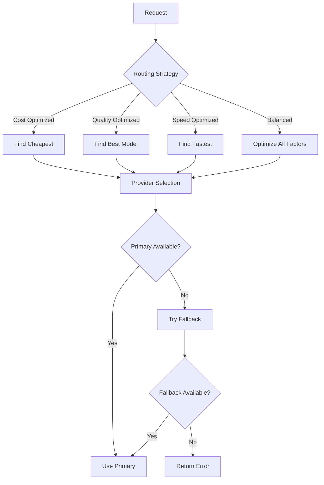

# LLM Provider Ecosystem

Claif Knollm supports **40+ LLM providers**, giving you unprecedented choice and flexibility in your AI applications. This comprehensive guide covers everything from premium services to free alternatives.

## Provider Categories

<div class="grid cards" markdown>

-   :material-crown:{ .lg .middle } **Premium Providers**

    ---

    High-quality, cutting-edge models from industry leaders like OpenAI, Anthropic, and Google.

    [:octicons-arrow-right-24: Explore Premium](catalog.md#premium-providers)

-   :material-flash:{ .lg .middle } **Fast & Affordable**

    ---

    Ultra-fast inference at budget-friendly prices from Groq, Cerebras, and DeepSeek.

    [:octicons-arrow-right-24: Explore Fast](catalog.md#fast-providers)

-   :material-open-source-initiative:{ .lg .middle } **Open Source**

    ---

    Community-driven models and free hosting from Hugging Face, Together AI, and Replicate.

    [:octicons-arrow-right-24: Explore Open Source](catalog.md#open-source-providers)

-   :material-tools:{ .lg .middle } **Specialized**

    ---

    Domain-specific providers for enterprise, research, and niche applications.

    [:octicons-arrow-right-24: Explore Specialized](catalog.md#specialized-providers)

</div>

## Provider Overview

### Premium Tier (Enterprise-Grade)

The highest quality models with the best capabilities:

| Provider | Models | Specialty | Avg Cost/1K | Context |
|----------|--------|-----------|-------------|---------|
| **OpenAI** | 25+ | GPT-4, o1, DALL-E | $0.015 | 128K |
| **Anthropic** | 12+ | Claude 3.5, Constitutional AI | $0.015 | 200K |
| **Google** | 15+ | Gemini 1.5, Gemma | $0.001 | 2M |
| **Mistral** | 12+ | European AI, Code | $0.007 | 32K |

### Fast & Budget Tier

Optimized for speed and cost efficiency:

| Provider | Models | Specialty | Avg Cost/1K | Speed |
|----------|--------|-----------|-------------|-------|
| **Groq** | 20+ | Ultra-fast inference | $0.0002 | 500+ tok/s |
| **Cerebras** | 8+ | High-speed processing | $0.0006 | 300+ tok/s |
| **DeepSeek** | 15+ | Code generation | $0.0014 | 200+ tok/s |
| **Together AI** | 50+ | Open model hosting | $0.0008 | 150+ tok/s |

### Open Source & Free Tier

Community models and free access:

| Provider | Models | Specialty | Cost | Access |
|----------|--------|-----------|------|--------|
| **Hugging Face** | 100+ | Open models | Free* | API + Transformers |
| **Replicate** | 80+ | Community models | Pay-per-use | Web + API |
| **Ollama** | 50+ | Local inference | Free | Local only |
| **HuggingChat** | 20+ | Chat interface | Free | Web + API |

*Free tier with limits, paid plans available.

## Key Provider Features

### Universal Coverage

Knollm provides unified access to providers offering:

- **Text Generation** - All providers
- **Chat Completion** - 38 providers  
- **Function Calling** - 25 providers
- **Vision/Multimodal** - 18 providers
- **Code Generation** - 30 providers
- **Embeddings** - 22 providers
- **Image Generation** - 12 providers

### Intelligent Routing

Automatic provider selection based on:



### Real-Time Failover

Built-in redundancy ensures reliability:

- **Health Monitoring** - Continuous provider health checks
- **Automatic Failover** - Seamless switching to backup providers
- **Load Balancing** - Distribute requests across healthy providers
- **Circuit Breakers** - Temporary exclusion of failing providers

## Provider Selection Guide

### Choose by Use Case

=== "Development & Testing"

    **Recommended:** Groq, DeepSeek, Hugging Face
    
    ```python
    from claif_knollm import KnollmClient, RoutingStrategy
    
    client = KnollmClient(
        routing_strategy=RoutingStrategy.COST_OPTIMIZED,
        fallback_providers=["groq", "deepseek", "huggingface"]
    )
    ```
    
    **Why:** Minimal costs, fast iteration, good for experimentation.

=== "Production Apps"

    **Recommended:** OpenAI, Anthropic, Google
    
    ```python
    client = KnollmClient(
        routing_strategy=RoutingStrategy.QUALITY_OPTIMIZED,
        fallback_providers=["openai", "anthropic", "google"]
    )
    ```
    
    **Why:** Highest quality, reliable service, comprehensive capabilities.

=== "High-Volume Processing"

    **Recommended:** Groq, Cerebras, Together AI
    
    ```python
    client = KnollmClient(
        routing_strategy=RoutingStrategy.SPEED_OPTIMIZED,
        fallback_providers=["groq", "cerebras", "together"]
    )
    ```
    
    **Why:** Ultra-fast processing, cost-effective at scale.

=== "Specialized Tasks"

    **Code:** DeepSeek, CodeLlama models
    **Vision:** GPT-4 Vision, Claude 3.5 Sonnet
    **Reasoning:** o1 models, Claude 3.5 Sonnet
    **Long Context:** Google Gemini (2M tokens), Claude (200K tokens)

### Choose by Budget

| Budget Level | Recommended Providers | Average Cost/1K Tokens |
|--------------|----------------------|------------------------|
| **Free** | Hugging Face, Ollama | $0.0000 |
| **Budget** ($0-$10/month) | Groq, DeepSeek, Together | $0.0002-$0.0008 |
| **Standard** ($10-$100/month) | Mistral, Cohere, AI21 | $0.001-$0.007 |
| **Premium** ($100+/month) | OpenAI, Anthropic, Google | $0.003-$0.015 |

## Getting Started with Providers

### 1. Set Up API Keys

Configure the providers you want to use:

```bash
# Premium providers
export OPENAI_API_KEY="your-openai-key"
export ANTHROPIC_API_KEY="your-anthropic-key"
export GOOGLE_API_KEY="your-google-key"

# Budget providers  
export GROQ_API_KEY="your-groq-key"
export DEEPSEEK_API_KEY="your-deepseek-key"
export TOGETHER_API_KEY="your-together-key"
```

### 2. Test Provider Connectivity

```bash
# Test all configured providers
knollm providers test

# Test specific providers
knollm providers test openai anthropic groq

# Check provider status
knollm providers status
```

### 3. Choose Your Strategy

```python
from claif_knollm import KnollmClient, RoutingStrategy

# Let Knollm choose the best provider automatically
client = KnollmClient(
    routing_strategy=RoutingStrategy.BALANCED,
    fallback_providers=["openai", "groq", "deepseek"]
)

# Make a request - provider chosen automatically
response = await client.create_completion(
    messages=[{"role": "user", "content": "Hello!"}]
)

print(f"Response from: {response.provider}")
```

## Provider Comparison Tools

Use Knollm's built-in tools to compare providers:

### CLI Comparison

```bash
# Compare providers by capability
knollm providers compare openai anthropic google --capability vision

# Compare by cost
knollm providers compare groq deepseek together --sort-by cost

# Detailed comparison table
knollm providers list --format detailed --tier premium
```

### Programmatic Comparison

```python
from claif_knollm import ProviderRegistry

registry = ProviderRegistry()

# Get providers by tier
premium_providers = registry.get_providers_by_tier("premium")
budget_providers = registry.get_providers_by_tier("budget")

# Compare specific providers
comparison = registry.compare_providers(
    ["openai", "anthropic", "groq"],
    criteria=["cost", "speed", "quality"]
)

for provider, scores in comparison.items():
    print(f"{provider}: {scores}")
```

## What's Next?

Dive deeper into the provider ecosystem:

1. **[Provider Catalog →](catalog.md)** - Detailed information on all providers
2. **[Provider Comparison →](comparison.md)** - Side-by-side feature comparison
3. **[Integration Guide →](integration.md)** - How to integrate specific providers
4. **[Cost Optimization →](../guides/optimization.md)** - Minimize your provider costs

---

<div class="admonition tip">
<p class="admonition-title">💡 Pro Tips</p>
<ul>
<li>Start with 2-3 providers from different tiers for redundancy</li>
<li>Use cost-optimized routing for development, quality-optimized for production</li>
<li>Monitor provider performance with <code>knollm providers stats</code></li>
<li>Set budget limits to avoid unexpected costs from premium providers</li>
</ul>
</div>